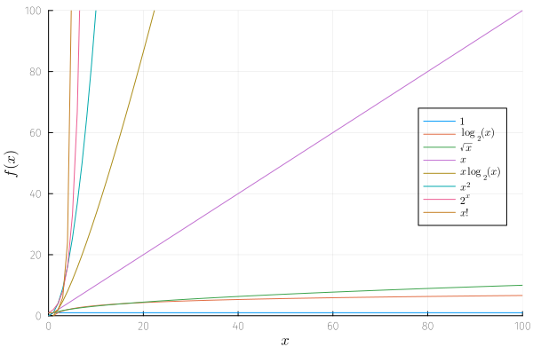

It describes the limiting behavior of a function when the argument tends toward a particular value or infinity. One writes

$$f(x) = O(g(x)), \quad\text{as}\quad x \rightarrow \infty.$$

In that case, we say that: $f(x)$ is of the order of $g(x)$. A characterization of that is 

$$\exists M > 0, \exists x_0 \in \mathbb{R} / \forall x \geq x_0, \left| f(x) \right| \leq M \left| g(x) \right|.$$

> [!EXAMPLE] Example
> A polynomial function $f$ is a big $O$ of its higher degree as $x \rightarrow \infty$. For all $n \in \mathbb{N}$, 
> $$f(x) = \sum_{i = 1}^{n} a_i x^{i} = O(x^{n}) \quad\text{as}\quad x \rightarrow \infty.$$

> [!IMPORTANT] Properties
> 1. $f_{1} = O(g_{1})$ and $f_{2} = O(g_{2}) \implies f_{1} f_{2} = O(g_{1} g_{2})$.
> 2. $f \cdot O(g) = O(fg)$.
> 3. $f_{1} = O(g_{1})$ and $f_{2} = O(g_{2}) \implies f_{1} + f_{2} = O(\max(|g_{1}|, |g_{2}|))$.
> 4. If $f = O(g)$, then, for $k > 0$, $k \cdot f = O(g)$.

## Orders of common functions 

Here, we list the common functions when analyzing the running time of an algorithm or the order of a function.

| Notation | Name | Example |
| -------: | :--: | :------ |
| $O(1)$   | contant | Finding the median value for a sorted array of numbers; Calculating $(-1)^{n}$. |
| $O(\log n)$ | logarithmic | Finding an item in a sorted array with a binary search. |
| $O(n)$ | linear | Finding an item in an unsorted list. |
| $O(n \log n)$ | loglinear | Performing a fast Fourier transform. |
| $O(n^2)$ | quadratic | Simple sorting algorithm. |
| $O(n^c)$ | polynomial | Order of polynomial functions. |
| $O(c^n)$ | exponential | Finding the exact solution to the travelling salesman problem. |
| $O(n!)$ | factorial | Solving the travelling salesman problem via brute-force search. |

