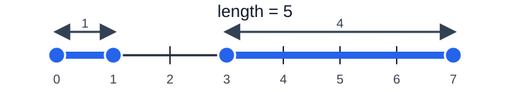

# Introduction to measure theory

The goal of measure theory is to make precise ideas like: *length*, *area*, *volume*, *probability*, *mass*, etc. For example, we know how to measure intervals: $[2, 5]$ has length $5 - 2 = 3$.

Measure theory asks a much more general question :

> Can we assign a meaningful size to all sets?


  Consider the set $\mathbb{Q} \cap [0, 1]$. As $\mathbb{Q}$ is dense in $[0, 1]$, it is spread everywhere. However, this set is small in a measure theoretic sense. Its Lebesgue measure is $0$.


## What's the intuition?

Suppose we want a function $\mu$ that assign a size to sets :

$$\mu(A) = \text{size of } A.$$

Especially, for subsets of $\mathbb{R}$, we would want that $\mu([a, b]) = b - a$. For example, $\mu([0, 1]) = 1$ and $\mu([3, 7]) = 4$. But we also want that the function $\mu$ to behave well under unions. So, if two sets $A$ and $B$ do not overlap, then we should have :
$$\mu(A \cup B) = \mu(A) + \mu(B).$$
For exemple, $[0, 1] \cup [3, 7]$ has total length of $1 + 4 = 5$.

Measure theory generalizes this idea to countably many disjoint sets : $A_1, A_2, A_3, \dots$ If these sets are pairwise disjoint, then we want 
$$\mu\left(\bigcup_{n = 1}^\infty A_n\right) = \sum_{n = 1}^{\infty} \mu(A_n).$$
This property is called  .

