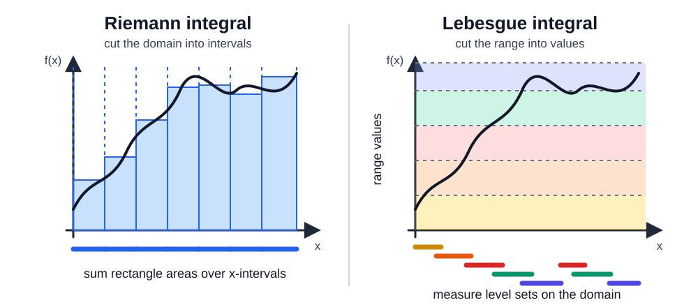

The Lebesgue integral consider the size of the set where a function takes certain values. 

Roughly speaking, the  cuts up the domain into intervals, while the Lebesgue integral cuts up the range into values and asks how large the corresponding level sets are.

