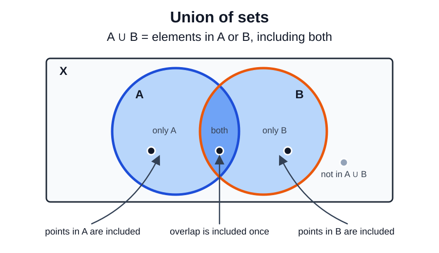
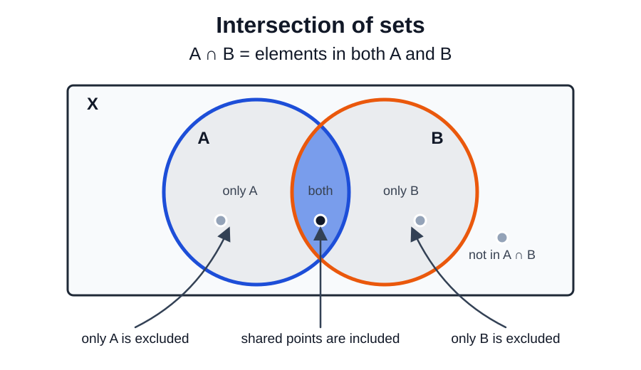
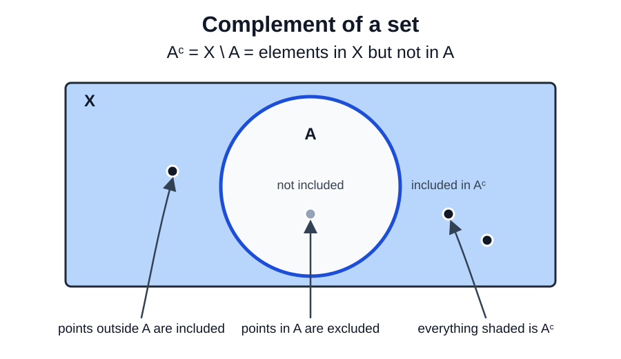
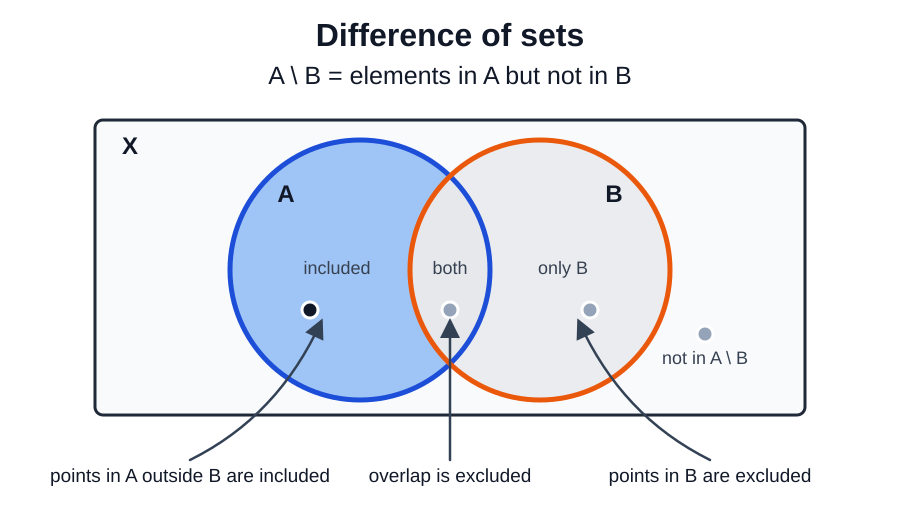
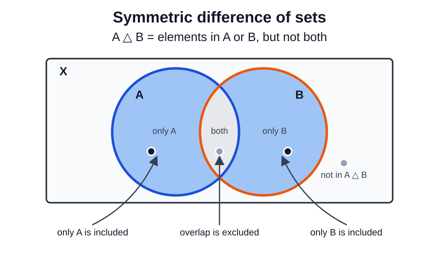

Let $X$ be a universe of discourse, like $X = \mathbb{R}$ or $X = [0, 1]$.


A subset $A \subseteq X$ is a collection of elements from $X$.


## Union 

Let $A$ and $B$ be two sets. The union of $A$ and $B$ is $A \cup B$. It consists of points that are in $A$, in $B$, or in both.

Formally, we write 
$$x \in A \cup B \Longleftrightarrow x \in A \text{ or } x \in B.$$

For a sequence of sets $A_1, A_2, A_3, \dots$, $\bigcup_{n = 1}^\infty A_n$ is the set of points that lie in at least one $A_n$:
$$x \in \bigcup_{n = 1}^\infty A_n \Longleftrightarrow \exists n \in \mathbb{N} \text{ such that } x \in A_n.$$


Let $X = \\{0, 1, 2, 3, 4, 5, 6\\}, A = \\{2, 4, 6\\}$ and $B = \\{0, 1, 2\\}$. Then $$A \cup B = \\{0, 1, 2, 4, 6\\}.$$


Let $X = \mathbb{R}, A = [0, 2]$ and $B = [1, 4]$. Then $$A \cup B = [0, 4].$$


## Intersection

Let $A$ and $B$ be two sets. The intersection of $A$ and $B$ is $A \cap B$. It consists of points common to both $A$ and $B$.

Formally, we write 
$$x \in A \cap B \Longleftrightarrow x \in A \text{ and } x \in B.$$

For a sequence of sets $A_1, A_2, A_3, \dots$, $\bigcap_{n = 1} A_n$ is the set of points that lie in every $A_n$:
$$x \in \bigcap_{n = 1}^\infty A_n \Longleftrightarrow \forall n \in \mathbb{N}, x \in A_n.$$


Let $X = \\{0, 1, 2, 3, 4, 5, 6\\}, A = \\{2, 4, 6\\}$ and $B = \\{0, 1, 2\\}$. Then $$A \cap B = \\{2\\}.$$


Let $X = \mathbb{R}, A = [0, 2]$ and $B = [1, 4]$. Then $$A \cap B = [1, 2].$$


## Complement

Let $A$ be a set. The complement of $A$ in $X$ is $A^c = X \backslash A$. It consists of all points in $X$ that are not in $A$.

Formally, we write 
$$x \in A^c \Longleftrightarrow x \not\in A.$$


The complement always depends on the ambient space $X$.



Let $X = \\{0, 1, 2, 3, 4, 5, 6\\}, A = \\{2, 4, 6\\}$. Then $$A^c  = \\{0, 1, 3, 5\\}.$$


Let $X = \mathbb{R}, A = [0, 2]$. Then $$A^c = (-\infty, 0) \cup (2, \infty).$$
But, if $X = [0, 4]$, then 
$$A^c = (2, 4].$$


## Difference

Let $A$ and $B$ be two sets. The difference of $A$ and $B$ is $A \backslash B = A \cap B^c$. It consists of points that are in $A$ but not in $B$.

Formally, we write 
$$x \in A \backslash B \Longleftrightarrow x \in A \text{ and } x \not\in B.$$


Let $X = \\{0, 1, 2, 3, 4, 5, 6\\}, A = \\{2, 4, 6\\}$ and $B = \\{0, 1, 2\\}$. Then $$A \backslash B = \\{4, 6\\}.$$


Let $X = \mathbb{R}, A = [0, 2]$ and $B = [1, 4]$. Then $$A \backslash B = [0, 1).$$


## Symmetric difference 

Let $A$ and $B$ be two sets. The symmetric difference of $A$ and $B$ is $A \bigtriangleup B = (A \backslash B) \cup (B \backslash A)$. It consists of points that lie in exactly one of $A$ or $B$.

Formally, we write 
$$x \in A \bigtriangleup B \Longleftrightarrow (x \in A \text{ or } x \in B) \text{ and } x \not\in A \cap B.$$


Let $X = \\{0, 1, 2, 3, 4, 5, 6\\}, A = \\{2, 4, 6\\}$ and $B = \\{0, 1, 2\\}$. Then $$A \bigtriangleup B = \\{0, 1, 4, 6\\}.$$


Let $X = \mathbb{R}, A = [0, 2]$ and $B = [1, 4]$. Then $$A \bigtriangleup B = [0, 1) \cup (2, 4].$$


